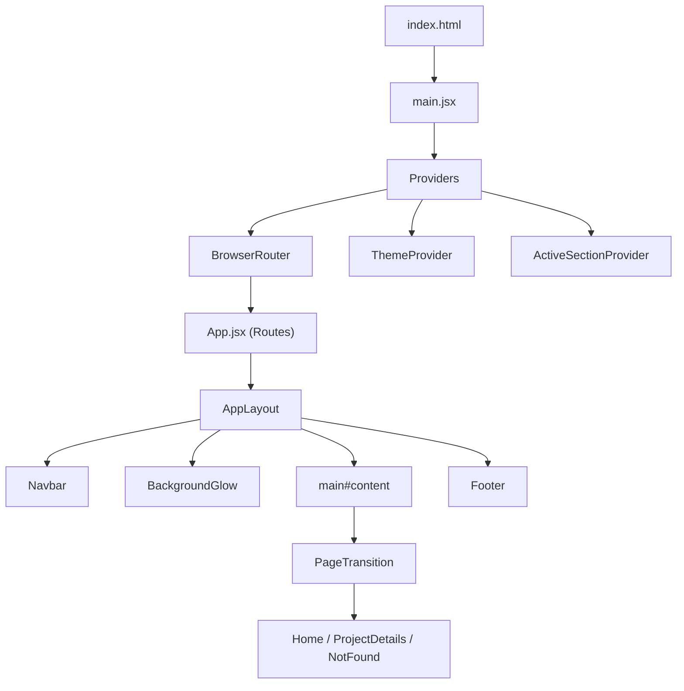
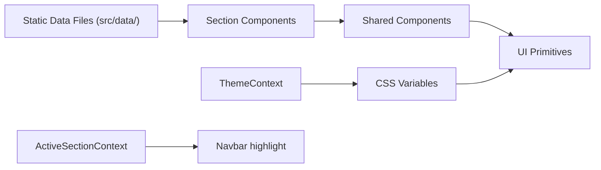

# Architecture

## Core Sections (Required)

### High-Level Architecture

This is a **single-page application (SPA)** built with React 19 and Vite. It follows a section-based portfolio pattern where the homepage renders all content sections vertically, with hash-based navigation for in-page scrolling.

### Provider Architecture

The app wraps all content in three nested providers (defined in `main.jsx`):

1. **BrowserRouter** — React Router for client-side routing
2. **ThemeProvider** — Manages light/dark/system theme via `localStorage` and `data-theme` attribute on `<html>`
3. **ActiveSectionProvider** — Tracks which section is currently in the viewport (via IntersectionObserver in `Section.jsx`)

### Routing

| Route | Component | Description |
|-------|-----------|-------------|
| `/` | `Home` | Landing page with all sections |
| `/project/:slug` | `ProjectDetails` | Individual project detail page |
| `*` | `NotFound` | 404 fallback |

All routes render inside `AppLayout`, which provides the persistent chrome (navbar, footer, background effects, custom cursor).

### Data Flow

**Data is entirely static.** There are no API calls, no backend, and no database. All project, experience, certification, and skill data lives in plain JavaScript files in `src/data/`. This means:
- No loading states for data (the 700ms skeleton is purely cosmetic)
- No error boundaries for data fetching
- Content updates require code changes to data files

### Theming System

The theme system works through CSS custom properties:

1. `ThemeContext.jsx` stores the user's preference (`'light'`, `'dark'`, or `'system'`) in localStorage
2. It resolves `'system'` to the actual OS preference via `matchMedia`
3. It sets `data-theme="light|dark"` on `<html>`
4. `index.css` defines all color tokens in `:root` (light) and `[data-theme="dark"]` selectors
5. All components reference tokens via `var(--token-name)` — no hard-coded colors

### Animation Architecture

Animations use two complementary systems:

1. **Framer Motion** — Component-level animations:
   - `AnimatePresence` for page transitions (`App.jsx`)
   - `motion.div` with `whileInView` for scroll-reveal (`About.jsx`, `Hero.jsx`)
   - `whileHover` for interactive feedback (`ProjectCard.jsx`)
   - Shared animation presets in `src/lib/motion.js`

2. **CSS Animations** — Ambient effects:
   - `@keyframes float` for background orbs
   - Tailwind utility animations (`animate-pulse` for skeletons)
   - `transition` classes for hover states

3. **Lenis** — Smooth scroll override via `useLenis` hook (disabled when `prefers-reduced-motion`)

### Component Patterns

- **UI Primitives** (`src/components/ui/`) — Styled with CVA variants, accept `className` prop for overrides via `cn()` (clsx + tailwind-merge)
- **Shared Components** — Receive data via props, render with motion wrappers
- **Section Components** — Self-contained page sections, import their own data from `src/data/`
- **Layout Components** — App shell and chrome, context-aware (theme, active section)

### Section Background System

Sections can have colored background tints via CSS classes:
- `.section-hero` → subtle green tint (`#F7FDF9`)
- `.section-certifications` → subtle yellow tint (`#FFFBEB`)
- `.section-contact` → subtle pink tint (`#FFF1F2`)
- Each has a dark-mode counterpart

### Projects Section Logic

The Projects section has the most complex rendering logic:
1. **Filter tabs** select a category (All, UIUX Design, Web Dev, etc.)
2. **Digital Content** category renders a `PinterestGallery` (4-col image grid)
3. All other categories render `ProjectCard` components in a 2-col grid
4. All categories are limited to 2 rows by default (4 cards or 8 gallery items)
5. A "See All →" / "Show Less" toggle expands/collapses the list
6. Filter changes reset the expanded state

---

### Evidence
- [main.jsx](file:///Users/fauzanghaza/Downloads/web-portofolio/src/main.jsx) — provider nesting order
- [App.jsx](file:///Users/fauzanghaza/Downloads/web-portofolio/src/App.jsx) — routing + AnimatePresence
- [AppLayout.jsx](file:///Users/fauzanghaza/Downloads/web-portofolio/src/components/layout/AppLayout.jsx) — layout composition
- [ThemeContext.jsx](file:///Users/fauzanghaza/Downloads/web-portofolio/src/context/ThemeContext.jsx) — theme system
- [Section.jsx](file:///Users/fauzanghaza/Downloads/web-portofolio/src/components/layout/Section.jsx) — IntersectionObserver
- [Projects.jsx](file:///Users/fauzanghaza/Downloads/web-portofolio/src/components/sections/Projects.jsx) — project filtering + layout logic
- [index.css](file:///Users/fauzanghaza/Downloads/web-portofolio/src/index.css) — design tokens, section tints
